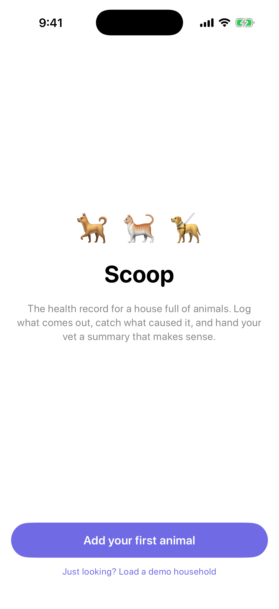
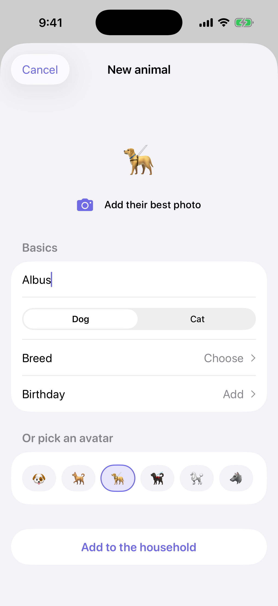
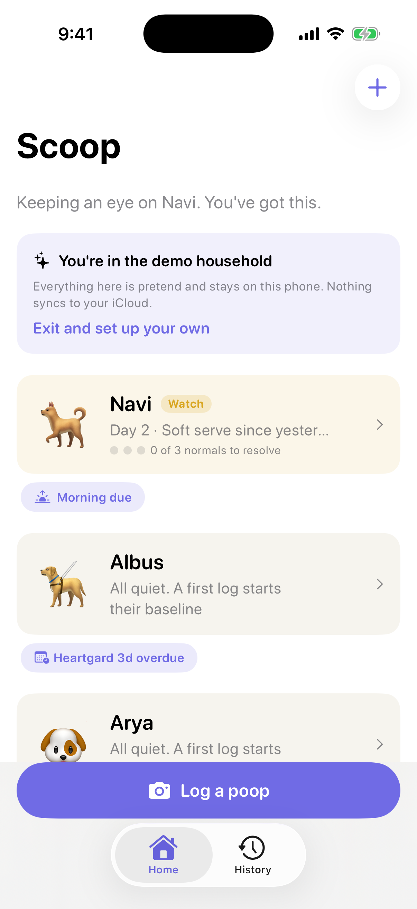
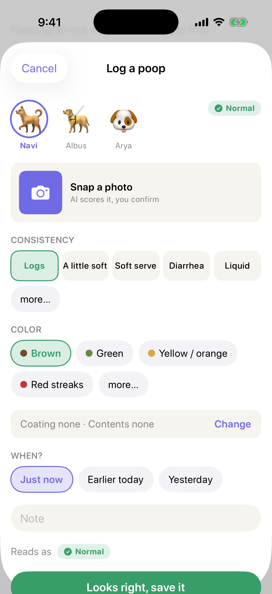
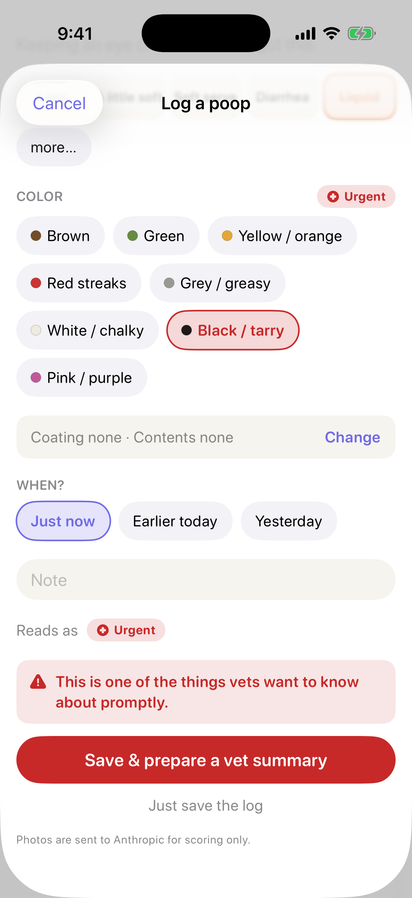
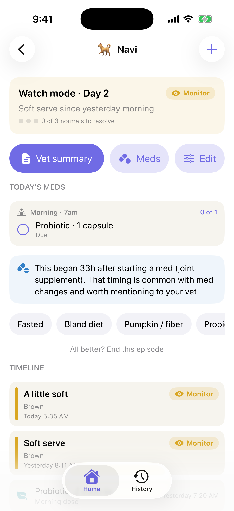
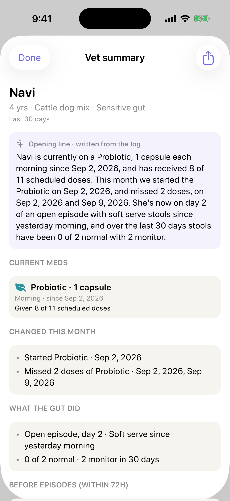

# Scoop

**The health record for a house full of animals.** A native SwiftUI iOS app, built from [a full PRD](docs/PRD.md): the product thinking came first, the code implements it. (Built under the name Gut Check, which the Xcode target still carries; renamed Scoop after checking the App Store field, where nine existing "Gut Check" apps are all human IBS trackers and no pet app is named Scoop.)

When an animal gets sick, its owner becomes an amateur epidemiologist overnight, tracing outputs back to inputs entirely from memory. Memory fails in predictable ways (stool lags intake by 12–36h; nobody records what "normal" looked like; last episode's fix is forgotten by the next one). Scoop is the instrument: episode-based tracking across a multi-pet household, camera-first capture, and a vet-legible summary on demand.

## Screens

| Onboarding | Add an animal | Home |
|---|---|---|
|  |  |  |

| Capture (4C) | Urgent breaks the layout |
|---|---|
|  |  |

| Pet timeline | Vet summary |
|---|---|
|  |  |

## Product decisions worth noticing

- **Episodes, not daily logs.** The central object is a bounded period of abnormality (baseline → watch → 3 consecutive normals → resolution). Healthy animals cost the user nothing; there is no streak to abandon.
- **The 4Cs.** Consistency, Color, Coating, Contents as four independent axes: a perfectly formed stool can still be black and tarry. Owners tap a five-point plain-language scale ("soft serve"); the vet-standard 1–7 value is stored underneath.
- **Urgent findings break the layout.** One-tap muscle memory is the point of capture, so when an axis hits the Urgent tier, the vet action becomes the primary button and plain save demotes to a text link.
- **Multi-pet is the wedge.** Different diets under one roof make the household a natural control group; cross-feeding ("who ate whose food") is a first-class event no single-pet app can represent.
- **Attribution handled honestly.** Anything that preceded an episode by ≤72h (cross-feeding, med changes, new items) is surfaced in the vet summary as association, phrased as questions for a professional. The app never diagnoses.
- **Playfulness lives in the language, not the icons.** "Soft serve" is a label, not a 🍦. Nothing cute appears past the Monitor tier, and poop photos are blurred until deliberately tapped.

## What's implemented

First-run onboarding (searchable breed picker, profile photo upload, "just looking" demo household) · household home with per-pet status, add-an-animal any time · 4C capture with photo attach (system picker) and real AI photo scoring via Claude (see below) and backdated logging ("just now / earlier today / yesterday" with a time picker for the retroactive options; the causal windows need honest timestamps) · named food and meds ("Food & meds": a piece of banana, a course of metronidazole, a daily CBD oil, each a reusable item so the third time it precedes an episode the record can say so) · per-pet regimen with morning/evening schedules, a one-tap daily checklist on the home screen, missed doses derived rather than stored, and local 7am/7pm reminders with a "Given" action · long-term meds on an interval (monthly heartworm, a monthly joint injection, a flea treatment every three months): the next dose is derived from the last one logged, surfaced on the pet screen and as a home-screen pill when it's due or coming up, reminded on the day and nagged each morning it's late, and reported to the vet as last given / next due · fixed-length courses ("weekly for 6 weeks", "twice a day for 10 days"): dose 3 of 6 on the checklist, nothing due past the end, and a one-tap "done with it" when the course is complete · four-tier triage ladder with liquid-frequency escalation · episode state machine (baseline → watch → 3 consecutive normals → resolved) with a manual end-episode escape hatch · one-tap interventions · 48-hour lookback · cross-feeding and med/stress exposure events · unified per-pet timeline with long-press delete (mis-logs must be fixable; they feed triage and the vet summary) · pet editing (photo, breed, birthday, conditions) · archive/restore animals (history kept) · CloudKit household sync with partner invites (see below) · shareable vet summary (30-day headline with age, a block per med with adherence and stools-before-vs-since, suspected triggers ≤72h before onset with counter-evidence, what was tried, flag log, questions-for-the-vet).

## Scope cuts

The PRD specs more than this. Three features were built, then deliberately cut to keep V1 honest. The core job is *track poop changes, capture what preceded them, hand the vet a summary*, and everything below needs episode history that a new user won't have:

- **Protocol capture & replay** ("this worked last time, run it again"). A retention feature that delivers nothing until episode #2, which may be months away. Interventions are still logged live ("what have you tried" is a question every vet asks), but they're a record, not a replayable protocol. Strongest V2 candidate.
- **The Insights tab.** The association engine's real distribution channel is the vet summary, where a professional interprets the correlations. A standalone insights screen is the most speculative surface in the app and the emptiest on day one.
- **Chronic pinning** (a mode for animals whose episode never closes). Real need, edge persona. The kind of thing you add when a chronically-ill-dog owner asks for it. *Partly back in:* the daily med checklist and reminders exist now because a chronically unwell dog in the house asked for them. They cost nothing for animals with no scheduled meds, which keeps the "healthy animals are free" rule intact.

**Also not yet:** PDF export, the second-opinion loop, a backend proxy for the AI call, and an AI pattern-spotting layer in the vet summary (designed but unbuilt; see "Where the AI deliberately isn't" below).

## AI photo scoring

Attach a photo in capture and Claude (`claude-sonnet-5`, vision) scores all four axes and prefills the chips. Design choices worth noticing:

- **The model proposes, the owner disposes.** Scores prefill the chips; the human can override every axis before saving, and the stored record is always owner-confirmed. The AI never writes to the record directly, which is how the no-diagnosis principle survives adding a model.
- **Structured output, not parsed prose.** The request forces a strict tool call whose schema enums match the app's `Codable` raw values exactly, so a malformed response is impossible rather than parsed hopefully.
- **Honest abstention.** The model returns `unscorable` per axis when the photo doesn't support a judgment, and low-confidence axes are flagged as "double-check" in the UI. A non-stool photo is called out instead of scored.
- **Graceful degradation.** No API key means the copy changes and capture is fully manual. Nothing breaks for repo cloners.

To enable it locally, create `GutCheck/Secrets.plist` (gitignored, bundled by an optional build step, never referenced by the committed project):

```xml
<?xml version="1.0" encoding="UTF-8"?>
<!DOCTYPE plist PUBLIC "-//Apple//DTD PLIST 1.0//EN" "http://www.apple.com/DTDs/PropertyList-1.0.dtd">
<plist version="1.0">
<dict>
    <key>ANTHROPIC_API_KEY</key>
    <string>sk-ant-your-key-here</string>
</dict>
</plist>
```

A key in the app bundle is a local-development convenience; shipping this for real means a small backend proxy holding the key server-side.

## Where the AI deliberately isn't

The vet summary has no prompt. Every line of it is computed: the headline counts are arithmetic over the 30-day window, the "preceded episodes by ≤72h" list is date math over logged exposures and cross-feeds, and even the questions for the vet are template strings filled from matched events. That's a decision, not a gap:

- **The summary is the document a vet acts on.** It's the last place you want generative variability. A deterministic summary is auditable: every sentence traces to a logged event, and nothing can be invented.
- **The dangerous failure isn't fabrication, it's soft inference.** A model summarizing "ate another pet's food 30h before onset" will drift toward "likely dietary indiscretion." Nothing was made up, but an association became a causal claim under the app's name. Keeping the summary deterministic enforces the no-diagnosis promise structurally instead of asking a prompt to hold the line.
- **So AI sits at the noisy input end** (photo scoring, where a human reviews every proposal before saving) **and stays out of the clinical output end** (the summary, which only aggregates what the owner confirmed).

There is a caged V2 design for AI in the summary, deliberately not built yet: a separate "patterns you might ask about" layer that reads the structured event log, returns observations via a strict tool call where each one must cite the event IDs supporting it (uncited observations are dropped in code before rendering), and renders visibly fenced off from the factual record, phrased as questions. It's unbuilt for the same reason protocol replay was cut: pattern-spotting across episodes has nothing to say until a user has multiple episodes, and a day-one summary would render an empty AI section. Strongest V2 pairing: replay says "this worked last time," patterns say "this preceded it last time."

## Household sync (CloudKit)

The multi-pet household is the wedge, so the household is also the sync unit: one partner owns the record zone in their private iCloud, shares it zone-wide (CKShare), and everyone else logs into the same zone from their own phone through the shared database. Built on CKSyncEngine with no backend at all; photos ride along as CKAssets.

- **The JSON store stays the source of truth.** CloudKit mirrors it: every domain record syncs as one CKRecord carrying the same JSON the local file stores, so there is exactly one schema and the tolerant-decoding rules protect both paths.
- **Graceful degradation, again.** No iCloud account, or a clone built without the CloudKit container, and the app is exactly as local-only as it was before sync existed. The sync row on the home screen says so instead of pretending.
- **Conflicts are last-writer-wins per record.** Two people rarely edit the same poop. The failure mode this accepts (simultaneous edits to the same record, one wins) is much cheaper than the merge machinery it avoids.
- **Joining replaces.** Accepting a household invite makes the shared household your household. V1 rule, documented rather than hidden.
- **The demo household never syncs.** "Just looking" is a clearly labeled local sandbox: the engines stay down while it's active, and it has an explicit exit back to onboarding. Demo animals that earlier builds leaked into a real household get scrubbed on sight, locally and from the zone. A demo animal that was renamed into a real one keeps its identity and loses only the pretend history it came with.

Activating it requires an Apple Developer Program membership (the iCloud container is provisioned through the paid account); without one the code paths above simply stay dark.

## Build & run

Requires Xcode with the iOS platform installed.

```bash
brew install xcodegen   # once
xcodegen generate
open GutCheck.xcodeproj
```

No dependencies: plain SwiftUI, iOS 16.4+, JSON persistence. The project file is generated from `project.yml`; domain logic (triage tiers, resolution counting) is UI-free in `GutCheck/Domain.swift` and unit-checked with the CLI toolchain alone.

## Provenance

Spec'd in [PRD v0.3](docs/PRD.md) (problem → target user → core model → workflows → success metrics → risks), then built and iterated in-simulator with [Claude Code](https://claude.com/claude-code). PRD and product direction by Meagan Glenn.
